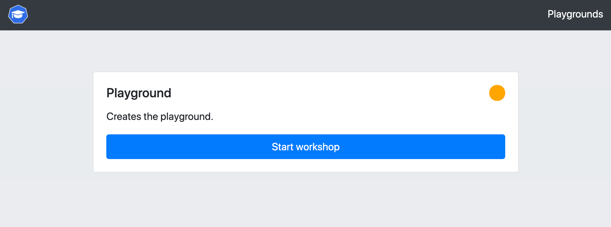
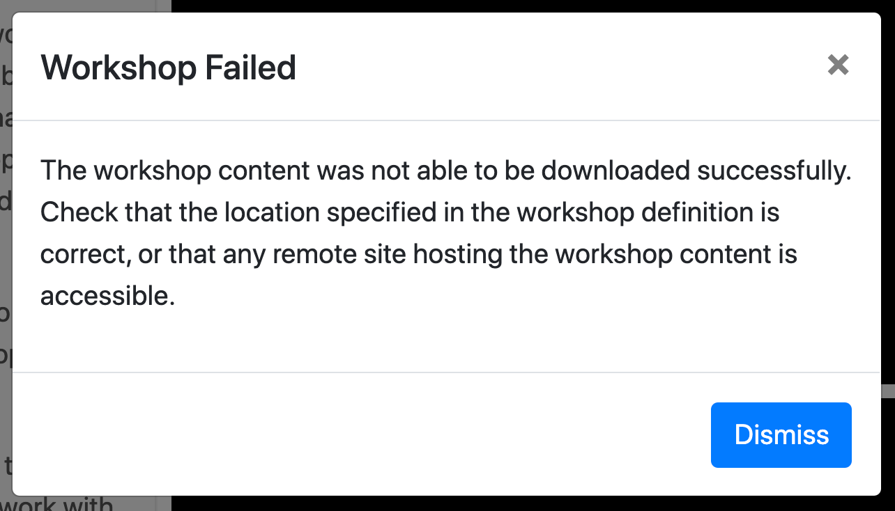

The way that the workshop playground works is that when you are given this workshop session which acts as the gateway to the playground, a separate instance of an Educates training portal is created just for your workshop session. This training portal is configured with a single workshop using a specific workshop base image.

Workshop base images that Educates provides include the following:

* ``base-environment`` - Basic workshop base image.
* ``jdk8-environment`` - Workshop base image for working with Java 8.
* ``jdk11-environment`` - Workshop base image for working with Java 11.
* ``conda-environment`` - Workshop base image for working with Anaconda Python.

but the workshop image could also be a custom workshop base image with additional tools.

Exactly which workshop base image is being used for this workshop playground will depend on which you selected when you initially created this workshop session.

To open up a separate browser window for the training portal instance for the playground click below.

```dashboard:open-url
url: {{ingress_protocol}}://{{session_namespace}}-playground.{{ingress_domain}}
```

The password for the training portal is:

```workshop:copy
text: {{registry_password}}
```

Once you have entered in the password, the training portal for the playground should look like:



Click on "Start Workshop" for the "Playground".

This should bring up the dashboard for another workshop session, except that there will be an error popup complaining that the workshop content could not be downloaded.



This is because the workshop sessions for the playground have been configured to pull the workshop content from a registry associated with this workshop session you are currently in, but as yet no workshop content has been loaded.

Dismiss the error dialog and select "Terminate Session" from the drop down menu top right of the dashboard the error was displayed against, not this workshop session. You can also click on the <span class="fa fa-sign-out-alt"></span> button in the toolbar of the dashboard. Confirm that you want to terminate the session and return back to the training portal with the various workshop environments displayed.
