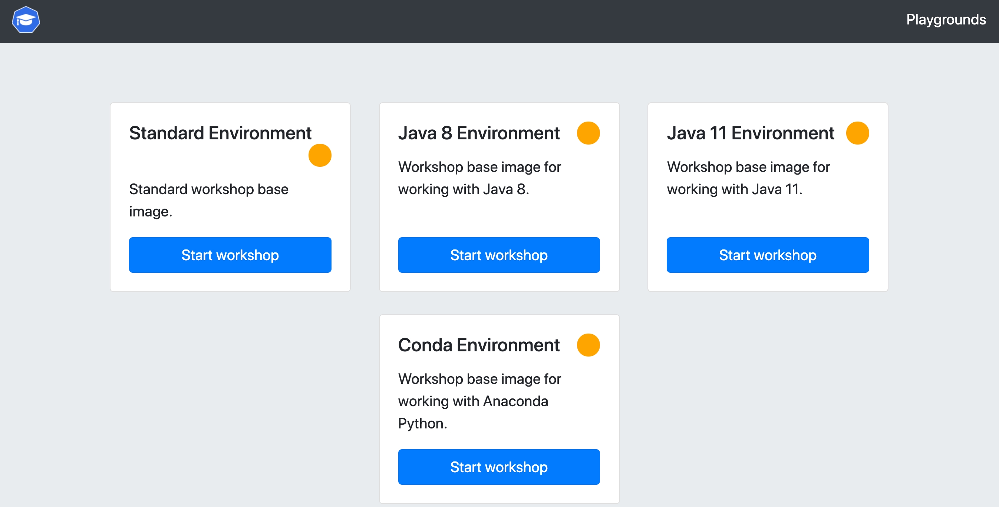
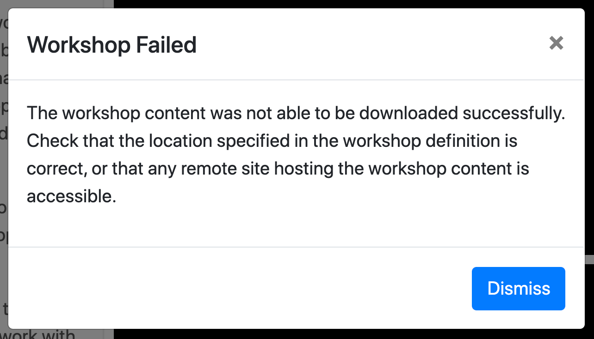

The way that the workshop playground works is that when you are given this workshop session which acts as the gateway to the playground, an instance of an Educates training portal is created just for your workshop session. This training portal is configured with a set of workshops, each corresponding to a different one of the supplied workshop base images. These workshop base images are:

* ``base-environment`` - Standard workshop base image.
* ``jdk8-environment`` - Workshop base image for working with Java 8.
* ``jdk11-environment`` - Workshop base image for working with Java 11.
* ``conda-environment`` - Workshop base image for working with Anaconda Python.

When you access the training portal instance for your playground, you can select which of the workshop images you want to work with.

Although there are multiple workshop images, the training portal instance has been configured to only allow you to run one at a time. The workshop session using that workshop image will also only be created on demand.

Open up a separte browser window for the training portal instance for the playground.

```dashboard:open-url
url: {{ingress_protocol}}://{{session_namespace}}-labs.{{ingress_domain}}
```

The password for the training portal is:

```workshop:copy
text: {{registry_password}}
```

Once you have entered in the password, the training portal for the playground should look like:



Click on "Start Workshop" for the "Standard Environment".

This should bring up the dashboard for another workshop session, except that there will be an error popup complaining that the workshop content could not be downloaded.



This is because the workshop sessions for the playground have been configured to pull the workshop content from a registry associated with this workshop session you are currently in, but as yet no workshop content has been loaded.

Dismiss the error dialog and select "Terminate Session" from the drop down menu top right of the dashboard the error was displayed (not this workshop session). You can also click on the <span class="fa fa-sign-out"></span> button in the toolbar of the dashboard. Confirm that you want to terminate the session and return back to the training portal with the various workshop environments displayed.
