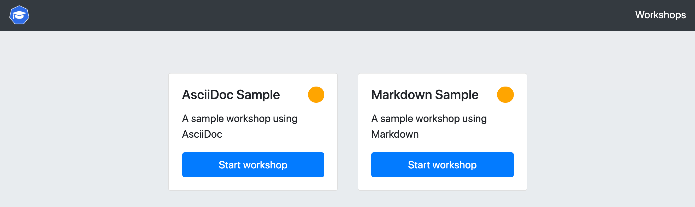

Now that you have the training portal and workshop environments deployed, you can access the training portal to select the workshop you wish to do.

For the training portal you just deployed, to view the URL for accessing it run:

```execute
kubectl get trainingportal/sample-workshops
```

This should display output similar to:

```
NAME               URL                                          ADMINUSERNAME   ADMINPASSWORD
sample-workshops   {{ingress_protocol}}://sample-workshops-ui.{{ingress_domain}}   eduk8s          mGI2C1TkHEBoFgKiZetxMnwAldRU80aN
```

At this point we are only interested in the URL, ignore the admin user name and password which are displayed.

Visit the URL which is listed.

```dashboard:open-url
url: {{ingress_protocol}}://sample-workshops-ui.{{ingress_domain}}
```

You should see:



Where as with the workshop you are currently working your way through, it was not necessary to login to the training portal for the sample workshops to view the available workshops. This is because the training portal resource for the sample workshops specified that anonymous access was allowed.

```editor:select-matching-text
file: ~/exercises/sample-workshops.yaml
text: "type: anonymous"
before: 1
after: 0
```

The training portal can be configured for anonymous access or user self registration. Any form of user registration can also be disabled, meaning that only a user with the admin credentials for the training portal can access it. The latter is how you would have accessed this workshop you are doing now. Details of configuration and user access can be found in the documentation.

```dashboard:reload-dashboard
name: Documentation
url: https://docs.edukates.io/en/latest/runtime-environment/training-portal.html#controlling-registration-type
```

In the case of anonymous access, it is also possible to still require an access code. This would be a single value that everyone would use to access the training portal.

```dashboard:reload-dashboard
name: Documentation
url: https://docs.edukates.io/en/develop/runtime-environment/training-portal.html#specifying-an-event-access-code
```

This is useful where you are running a workshop at a conference and want to allow anonymous access, but only want people who are present in the room and who are given the code, to access it.
